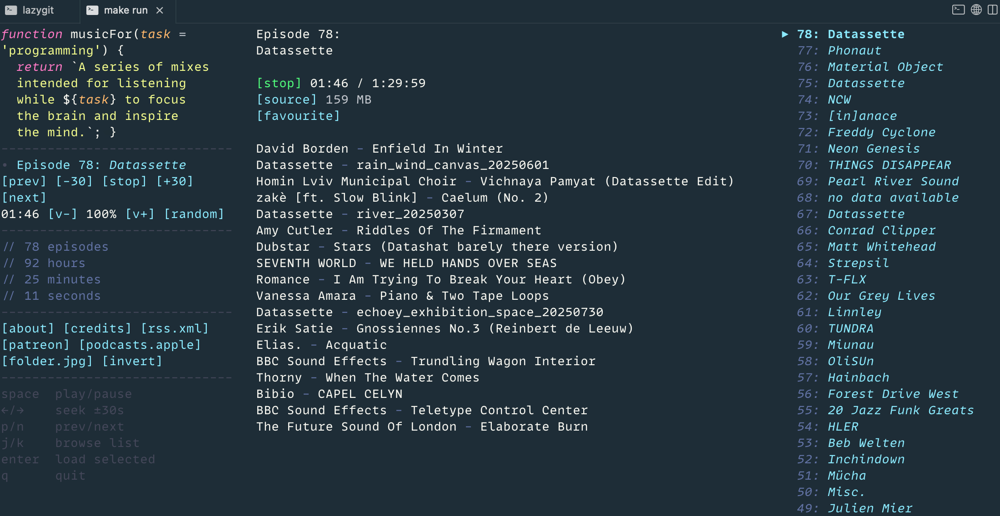

# mfp

> **Unofficial client** — not affiliated with or endorsed by [musicforprogramming.net](https://musicforprogramming.net) or Datassette. All audio content belongs to its respective artists. This tool streams directly from MFP's own servers — no content is hosted or redistributed.

A terminal UI for [musicforprogramming.net](https://musicforprogramming.net) — Go + Bubble Tea.

Streams all 78 MFP episodes in your terminal with a three-pane layout, full
tracklist display, and a Dracula-inspired colour palette that mirrors the original site.



---

## Prerequisites

| Tool | Version | Install |
|------|---------|---------|
| Go | 1.22+ | `brew install go` |
| mpv | any | `brew install mpv` |

---

## Quick start

> **Prerequisite:** `brew install mpv` (installed automatically via Homebrew)

```bash
# Option A — Homebrew (recommended)
brew tap fpigeonjr/homebrew-tap
brew install mfp

# Option B — go install (requires Go 1.22+)
go install github.com/fpigeonjr/music-for-coding-tui/cmd/mfp@latest

# Option C — build from source
git clone https://github.com/fpigeonjr/music-for-coding-tui.git
cd music-for-coding-tui
make install
```

```bash
# Run
mfp
```

---

## Controls

| Key | Action |
|-----|--------|
| `space` | Play / pause |
| `→` or `l` | Seek forward 30s |
| `←` or `h` | Seek back 30s |
| `n` / `]` | Next (older) episode |
| `p` / `[` | Previous (newer) episode |
| `j` / `↓` | Scroll episode list down |
| `k` / `↑` | Scroll episode list up |
| `enter` | Play selected episode |
| `q` / `Ctrl+C` | Quit |

---

## Layout

```
┌─ Left ──────────────┬─ Center ──────────────────┬─ Right ──────────────┐
│ function musicFor(  │ Episode 78:               │ ▶ 78: Datassette     │
│   task='programming'│ Datassette                │   77: Phonaut        │
│ ) { return `...` }  │                           │   76: Material Object│
│ ─────────────────── │ [stop] 01:46 / 1:29:59    │   75: Datassette     │
│ • Episode 78: ...   │ [source] 159 MB           │   74: NCW            │
│ [prev][-30][stop]   │ [favourite]               │   ...                │
│ [+30][next]         │                           │                      │
│ ─────────────────── │ David Borden - Enfield... │                      │
│ // 78 episodes      │ Datassette - rain_wind... │                      │
│ // 92 hours         │ ...                       │                      │
│ ─────────────────── │                           │                      │
│ [about][credits]... │                           │                      │
└─────────────────────┴───────────────────────────┴──────────────────────┘
```

---

## Development

```bash
make run        # run from source
make build      # compile → ./music-for-coding-tui
make test       # unit tests only (no network, no mpv)
make test-full  # all tests including live RSS + mpv integration
make lint       # go vet
make tidy       # go mod tidy
```

---

## Roadmap

| Phase | Goal | Status |
|-------|------|--------|
| 1 | Audio plumbing — mpv IPC, play/pause/seek, status line | ✅ Done |
| 2 | RSS + episode model — parse feed, prev/next navigation | ✅ Done |
| 3 | Three-pane layout — left transport, center tracklist, right index | ✅ Done |
| 4 | MFP aesthetic — Dracula palette, syntax-highlighted preamble, cyan `[tokens]` | ✅ Done |
| 5 | Niceties — favorites, random, volume, resume position | ✅ Done |
| 6 | Distribution — tag v0.1.0, `go install` from GitHub | 🔜 Next |
| 7 | Homebrew tap — `brew tap fpigeonjr/homebrew-tap && brew install mfp` | ✅ Done |
| 8 | goreleaser — pre-built arm64/amd64 bottles, no Go required | ⏳ Planned |
| 9 | homebrew-core — `brew install mfp` with no tap | ⏳ Planned |

---

## Testing

```bash
make test       # 37 unit tests — no mpv or network required
make test-full  # + 9 integration tests (mpv + live RSS/tracklist)
```

See [docs/phase-1-smoketest.md](docs/phase-1-smoketest.md) for the manual QA checklist.

---

## Architecture

```
cmd/mfp/
  main.go    — entry point
  model.go   — model struct, messages, pane geometry
  update.go  — Init(), Update(), all tea.Cmd functions
  view.go    — View(), all render* helpers
  styles.go  — Dracula colour palette + Lip Gloss style registry

internal/
  player/    — mpv IPC client (spawn, load, pause, seek, get_state)
  feed/      — RSS fetch + parse, tracklist scraping, disk cache
```

---

## License

MIT
