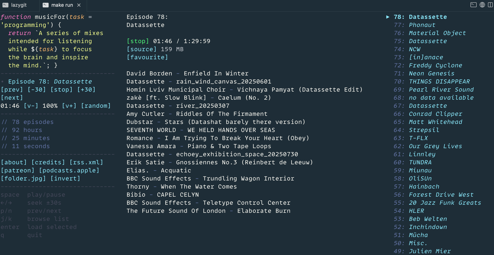

# mfp — Terminal client for musicforprogramming.net

[](https://github.com/fpigeonjr/music-for-coding-tui)
[](https://github.com/fpigeonjr/music-for-coding-tui/releases)
[](https://github.com/fpigeonjr/homebrew-tap)
[](https://goreportcard.com/report/github.com/fpigeonjr/music-for-coding-tui)
[](LICENSE)
[](https://github.com/fpigeonjr/music-for-coding-tui/stargazers)

> Unofficial client — not affiliated with [musicforprogramming.net](https://musicforprogramming.net) or Datassette, but built with his blessing. All audio content belongs to its respective artists. This tool streams directly from MFP's servers — no content is hosted or redistributed.

---

**Stream all 78+ MFP episodes in your terminal** with a three-pane Bubble Tea TUI, full tracklist display, five colour themes, and persistent state. No browser, no tabs, no distractions — just code and music.


---

## Why?

[musicforprogramming.net](https://musicforprogramming.net) is a curated collection of ambient / experimental electronic mixes designed for — you guessed it — programming. But it's a website. You keep it in a browser tab, it eats memory, and every time you reach for it there's friction.

**mfp** puts it in your terminal. One command and you're browsing, searching, and streaming all 78 episodes without leaving your editor. Built for the kind of person who lives in the terminal and wants their music there too.

---

## Features

- **78 episodes** — full catalogue from Datassette to the latest release, fetched and cached
- **Three-pane layout** — transport + info on the left, tracklist centre, episode index right
- **5 themes** — Dracula, Nord, Gruvbox, One Dark, Everforest Dark (cycle with `t`)
- **Persistent state** — resume position, favourites, volume, last episode, and theme all survive restarts
- **Vim-style command bar** — hit `/` for `theme`, `jump`, `vol`, `fav`, `random`, and more
- **OSC 8 hyperlinks** — clickable URLs for episodes, about, credits, rss, patreon
- **Random episode** — `r` to discover something unexpected
- **Favourites** — star episodes with `f`, persisted across sessions
- **Volume boost** — 0–150% range with orange indicator when boosted
- **Cross-platform** — darwin/arm64, darwin/amd64, linux/arm64, linux/amd64
- **Lightning fast** — written in Go with [Bubble Tea](https://github.com/charmbracelet/bubbletea), launches instantly

---

## Quick start

### macOS — Homebrew

```bash
brew tap fpigeonjr/homebrew-tap
brew install mfp
mfp
```

> `mpv` is installed automatically as a dependency.

### Any platform — Go install (requires Go 1.22+)

```bash
go install github.com/fpigeonjr/music-for-coding-tui/cmd/mfp@latest
mfp
```

> Requires `mpv` separately: `brew install mpv`

### Build from source

```bash
git clone https://github.com/fpigeonjr/music-for-coding-tui.git
cd music-for-coding-tui
make install
mfp
```

---

## Screenshots



| Dracula (default) | Nord | Gruvbox | One Dark | Everforest |
|---|---|---|---|---|
| Default | Cool blue‑grey | Warm retro | VS Code feels | Earthy green |

Cycle through themes with the `t` key. Selection persists to `theme.json`.

---

## Controls

| Key | Action |
|-----|--------|
| `space` | Play / pause |
| `→` / `l` | Seek forward 30s |
| `←` / `h` | Seek back 30s |
| `n` / `]` | Next (older) episode |
| `p` / `[` | Previous (newer) episode |
| `j` / `↓` | Scroll episode list down |
| `k` / `↑` | Scroll episode list up |
| `enter` | Play selected episode |
| `r` | Random episode |
| `f` | Toggle ★ favourite |
| `-` / `=` | Volume ±10% (0–150%) |
| `t` | Cycle theme |
| `/` | Open command bar |
| `?` | Keybindings overlay |
| `Ctrl+R` | Reset player |
| `q` / `Ctrl+C` | Quit |

**Command bar** (`/`): type `theme gruvbox`, `jump 42`, `vol 80`, `fav`, `random`, `help`, `quit`.

---

## Layout

```
┌─ Left ──────────────┬─ Center ──────────────────┬─ Right ──────────────┐
│ function musicFor(  │ Episode 78:               │ ▶ 78: Datassette     │
│   task='programming'│ Datassette                │   77: Phonaut        │
│ ) { return `...` }  │                           │   76: Material Object│
│ ─────────────────── │ [stop] 01:46 / 1:29:59    │   75: Datassette     │
│ • Episode 78: ...   │ [source] 159 MB           │   74: NCW            │
│ [prev][-30][stop]   │ [favourite]               │   ...                │
│ [+30][next]         │                           │                      │
│ ─────────────────── │ David Borden - Enfield... │                      │
│ // 78 episodes      │ Datassette - rain_wind... │                      │
│ // 92 hours         │ ...                       │                      │
│ ─────────────────── │                           │                      │
│ [about][credits]... │                           │                      │
└─────────────────────┴───────────────────────────┴──────────────────────┘
```

---

## State persistence

All state lives in `~/.config/music-for-coding/`:

| File | Contents |
|------|----------|
| `positions.json` | Resume position per episode |
| `favourites.json` | Starred episode numbers |
| `volume.json` | Last used volume level |
| `theme.json` | Active colour theme |
| `last-episode.json` | Last playing episode |
| `debug.log` | Structured debug log (last 500 lines) |

---

## Development

```bash
make run        # run from source
make build      # compile → ./music-for-coding-tui
make install    # install mfp → $GOPATH/bin
make test       # unit tests (no network, no mpv required)
make test-full  # all tests including live RSS + mpv integration
make lint       # go vet
make tidy       # go mod tidy
```

---

## Roadmap

| Phase | Goal | Status |
|-------|------|--------|
| 1–8 | Audio, RSS, three-pane layout, themes, Homebrew, goreleaser | ✅ Complete |
| 9 | **Homebrew core** — `brew install mfp` with no tap | 🔜 ~75★ needed for [notability](https://docs.brew.sh/Acceptable-Formulae#niche-or-self-submitted-stuff) |
| 10–11 | Themes, command bar, OSC 8 links | ✅ Complete |

---

## Architecture

```
cmd/mfp/
  main.go    — entry point, --version flag
  model.go   — model struct, messages, pane geometry, scroll logic
  update.go  — Init(), Update(), all tea.Cmd functions
  view.go    — View(), all render* helpers, preamble syntax highlight
  styles.go  — Dracula colour palette + Lip Gloss style registry

internal/
  player/    — mpv IPC client (spawn, load, pause, seek, volume, get_state)
  feed/      — RSS fetch + parse, tracklist scraping, 1h disk cache
  store/     — persistent state (favourites, positions, volume, theme, last episode)
```

---

## Testing

```bash
make test       # 140 unit tests — no mpv or network required
make test-full  # + live RSS + tracklist + mpv integration tests
```

See [docs/phase-1-smoketest.md](docs/phase-1-smoketest.md) for the manual QA checklist.

---

## Known issues

| Issue | Terminal | Workaround |
|-------|----------|------------|
| OSC 8 hyperlinks not clickable via `Cmd+click` | Ghostty / tmux | Hover shows URL preview; use iTerm2, kitty, or WezTerm for full click support. Upstream: [ghostty#11907](https://github.com/ghostty-org/ghostty/issues/11907) |

---

## Releasing

```bash
git tag v0.x.0
git push origin v0.x.0
```

GitHub Actions will run all tests, build binaries for all platforms, publish a release, and update `Formula/mfp.rb` in `fpigeonjr/homebrew-tap` automatically.

---

## License

MIT

## Related

- [musicforprogramming.net](https://musicforprogramming.net) — the source
- [Bubble Tea](https://github.com/charmbracelet/bubbletea) — the TUI framework
- [mpv](https://mpv.io/) — the media player
